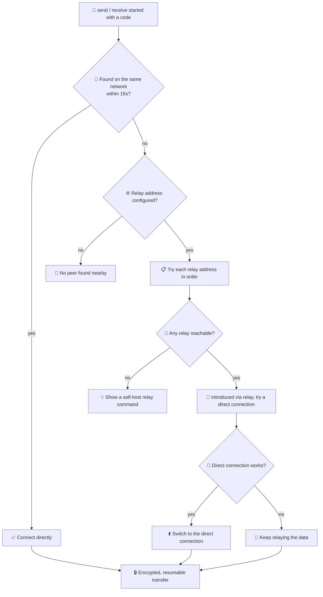

# 📦 parcel

<div align="center">

[](go.mod)
[](deps-proof.txt)
[](LICENSE)
[](#)
[](#)
[](#)


</div>

A peer-to-peer, end-to-end encrypted file and folder transfer tool. Two
people share a short spoken code, and parcel connects them directly — over
the same Wi-Fi, or across the internet through an optional relay. Dropped
connections resume automatically instead of starting over. No accounts, no
cloud storage, no third-party code — `go.mod` has no `require` block.

Built for the **Zero Dependency** hackathon, **Track C (Web & Network)**.

**Contents:** [🔎 At a glance](#at-a-glance) · [✨ What it does](#what-it-actually-does) ·
[📸 See it in action](#see-it-in-action) · [⚡ Quick start](#quick-start) ·
[🌐 Crossing networks](#crossing-networks) · [🧩 Why zero-dependency](#why-zero-dependency) ·
[🔍 Verifying it](#verifying-zero-dependencies) · [🔁 Reproducible build](#reproducible-build) ·
[🗂️ Layout](#layout) · [✅ What's been verified](#whats-been-verified) · [📄 License](#license)

---

## 🔎 At a glance

| | |
|---|---|
| 🔑 **Pairing** | 4-word spoken code, generated securely |
| 🔒 **Encryption** | Strong encryption (the kind behind HTTPS) — wrong code, no connection |
| 🌐 **Connectivity** | Same network first, then a direct connection, then a relay as backup |
| ♻️ **Resumable** | Picks up right where a dropped connection left off |
| 📁 **Folders** | Sends whole folders, compressing them when it helps |
| 📷 **QR pairing** | Optional on-screen QR code as a shortcut for typing |
| 🧩 **Dependencies** | Zero — nothing but Go's standard library |

---

## ✨ What it actually does

| | |
|---|---|
| 🔑 **Pairing** | `parcel send` prints a code like `crimson-otter-lagoon-basil`. Run `parcel receive <code>` on the other machine and it connects on its own. |
| 🔒 **Encryption** | A key exchange (`crypto/ecdh`, X25519) confirmed by the shared code, then AES-256-GCM on every chunk — see `internal/crypto`. Wrong code, no connection. |
| 🔌 **Connection** | Same-network first (`internal/discovery/lan.go`); otherwise a relay introduces both sides, tries a direct link, and relays the data if that's not possible (`internal/discovery/punch.go`). |
| ♻️ **Resumable** | The receiver remembers the last verified chunk in `.part.meta`; the sender picks up right there on reconnect, within the code's 5-minute window. |
| 📁 **Folders** | Packed into one stream (`internal/archive`) and compressed with `compress/flate` (`internal/compress`) when that actually helps. |
| 📷 **QR pairing** | `-qr` on `send` also shows the code as an on-screen QR code (`internal/qr`) — a shortcut, not a replacement for the spoken code. |

### 🗺️ How it picks a connection path



---

## 📸 See it in action

| Sender | Receiver |
|---|---|
|  |  |
| *(placeholder — drop a screenshot at `docs/screenshot-sender.png`)* | *(placeholder — drop a screenshot at `docs/screenshot-receiver.png`)* |

Same flow on Windows, macOS, or Linux — `parcel` is a single binary with no
install step.

---

## ⚡ Quick start

```sh
go build -o bin/parcel ./cmd/parcel
# or: make build
```

On one machine:

```sh
./bin/parcel send ./photo.jpg
# Your code: crimson-otter-lagoon-basil
```

On the other machine (same network, or with a relay configured — see below):

```sh
./bin/parcel receive crimson-otter-lagoon-basil
```

A directory works the same way (`./bin/parcel send ./my-folder`); it
arrives unpacked back into a directory on the receiving end.

### 🌐 Crossing networks

**🤔 Why you need a relay:** same-network discovery works by broadcasting to
nearby devices — it physically can't reach a machine on a different
network (different Wi-Fi, different building, different country). When
the two of you aren't on the same network, something reachable from both
sides has to introduce you. That's the relay's whole job: a small program
that helps two `parcel` clients find each other, and forwards data between
them if a direct connection can't be made. It only ever sees
already-encrypted bytes — it can't read the file either way.

**1️⃣ Start a relay**, on any machine both sides can reach — a VPS, a spare
computer, a cheap cloud instance:

```sh
./bin/parcel relay -addr :4321
```

**2️⃣ Send**, pointing at that relay:

```sh
./bin/parcel send ./photo.jpg -relay relay.example.com:4321
```

**3️⃣ Receive**, pointing at the same relay:

```sh
./bin/parcel receive crimson-otter-lagoon-basil -relay relay.example.com:4321
```

(or set `PARCEL_RELAY` once instead of passing `-relay` every time).

`-lan-only` / `-relay-only` force a specific path. `-relay` also takes a
comma-separated list (`-relay a.example.com:4321,b.example.com:4321`) —
parcel tries each in order and uses the first that answers; give both
sides the same list in the same order, since pairing only happens when
both land on the same relay. If none answer, parcel prints the exact
command to run your own relay.

On a laptop with more than one network connection (Wi-Fi + Ethernet + VPN),
pin both sides to the same one with `-iface <name-or-ip>` (or
`PARCEL_LAN_IFACE`) so discovery looks in the same place on both ends.

#### 📸 Relay in action

| Relay | Sender | Receiver |
|---|---|---|
|  |  |  |
| *(placeholder — `docs/screenshot-relay.png`)* | *(placeholder — `docs/screenshot-relay-sender.png`)* | *(placeholder — `docs/screenshot-relay-receiver.png`)* |

---

## 🧩 Why zero-dependency

The idea here — code-based pairing, encrypted transfer, resuming after a
drop, relaying past NAT — isn't new. `croc` (`github.com/schollz/croc`)
already does it, well. What's different is what it's built from: every
third-party package a tool imports is code nobody here wrote or reviewed,
with its own dependencies riding along. `go.mod` has no `require` block —
everything is either Go's standard library or code written in this repo,
short enough to actually read end-to-end.

```
Third-party runtime dependencies

croc     ████████████████████████████████████████████████ 19
parcel   ▏0
```

<details>
<summary><strong>📊 Head-to-head vs croc — expand for the full dependency comparison</strong></summary>

| 📦 croc depends on | 🎯 what it's for | 🔧 what parcel uses instead |
|---|---|---|
| `github.com/skip2/go-qrcode` | generates QR codes | its own QR encoder, built from the QR spec — `internal/qr` |
| `github.com/schollz/pake/v3` | code-based key exchange | `crypto/ecdh` (X25519) plus a small hand-written key-derivation step that mixes in the shared code — `internal/crypto/handshake.go` |
| `golang.org/x/crypto` | encryption building blocks | `crypto/aes` + `crypto/cipher`, and `crypto/pbkdf2` (in Go's standard library since 1.24) |
| `github.com/schollz/peerdiscovery` | finds peers on the local network | a small UDP broadcast — `internal/discovery/lan.go` |
| `github.com/kalafut/imohash`, `github.com/cespare/xxhash/v2`, `github.com/minio/highwayhash` | fast file hashing | `crypto/sha256` for verifying each chunk — `internal/transfer` |
| `github.com/schollz/cli/v2` | command-line parsing | Go's own `flag` package |
| `github.com/stretchr/testify` | test assertions | Go's own `testing` package |
| `golang.org/x/net`, `golang.org/x/sys`, `golang.org/x/term`, `golang.org/x/time` | extra OS/network helpers | not needed — `net`, `os`, and `time` cover it |

croc also has a few things parcel doesn't try to match: skipping
`.gitignore`-matched files when sending a folder, a SOCKS5 proxy option,
and interactive prompts. Smaller scope, not a hidden gap.

</details>

### 🔐 Self-hosting the relay

croc automatically picks one of three shared public relays for you. Parcel
leaves that choice to you — `-relay`/`PARCEL_RELAY` is empty by default.
Run `parcel relay -addr :4321` on any machine you already have — 🖥️ a VPS,
a spare computer, a cheap cloud instance — and point both sides at it.

🔒 Encryption is what protects the file, no matter whose relay carries it.
Choosing your own relay just means it's your machine, your uptime, nobody
else's logs in between — and it can be listed first in the fallback list
above.

---

## 🔍 Verifying zero dependencies

```sh
go list -m all       # prints only "parcel" — see deps-proof.txt
```

See `STDLIB.md` for exactly what each substitution replaces.

## 🔁 Reproducible build

```sh
make reproducible
```

Builds the artifact twice (`-trimpath -buildvcs=false`, so the result
doesn't depend on the build path or git state) and diffs them — verified
byte-identical, including from a second, unrelated directory.

<details>
<summary>Actual captured run</summary>

```
$ go build -trimpath -buildvcs=false -o bin/parcel-a ./cmd/parcel
$ go build -trimpath -buildvcs=false -o bin/parcel-b ./cmd/parcel
$ sha256sum bin/parcel-a bin/parcel-b
03dc436cad930caf9fbfdb8aa93340ac9e5222c63bd9628cb584c752dd4498e2 *bin/parcel-a
03dc436cad930caf9fbfdb8aa93340ac9e5222c63bd9628cb584c752dd4498e2 *bin/parcel-b
$ cmp bin/parcel-a bin/parcel-b && echo byte-identical
byte-identical
```

</details>

---

## 🗂️ Layout

<details>
<summary>Expand folder tree</summary>

```
parcel/
├── cmd/parcel/           CLI entrypoint (send/receive/relay subcommands)
├── internal/
│   ├── codeword/         pairing-code generation (crypto/rand wordlist draw)
│   ├── crypto/           X25519 handshake + AES-GCM chunk stream
│   ├── transfer/         resumable chunked wire protocol, timeouts
│   ├── archive/          hand-rolled folder pack/unpack format
│   ├── compress/         compress/flate wrapper with a skip-if-useless heuristic
│   ├── discovery/        LAN multicast discovery, relay server/client, NAT punching
│   ├── source/           prepares a path (archive? compress?) before sending
│   └── qr/               from-scratch QR encoder (+ a decoder, used only for tests)
├── Makefile              build / test / vet / deps-proof / reproducible
├── STDLIB.md             every stdlib-for-package substitution made
└── deps-proof.txt        go list -m all output
```

</details>

Tests live next to the code they cover (`_test.go` files, Go's own idiom)
rather than a separate `tests/` tree.

---

## ✅ What's been verified

| Area | Status |
|---|---|
| 🖥️ Local network transfer | ✅ Verified on real hardware (Windows + Linux VM) — byte-identical results |
| 🌍 Cross-network / relay | ✅ Verified across two separate machines — byte-identical results |
| 📷 QR pairing | ✅ Verified with a real phone camera scan |
| 🔌 Direct internet connection | ✅ Works on most home routers; falls back to relaying the data automatically elsewhere |
| 🔑 Pairing codes | ✅ 4 words, chosen to keep coincidental matches astronomically rare |
| 🗜️ Compression | ✅ Skipped automatically when it wouldn't help (photos, videos, zips) |

A couple of good-to-knows: on a machine with more than one network
connection, use `-iface`/`PARCEL_LAN_IFACE` (see
[Crossing networks](#crossing-networks)) so both sides look in the same
place; and the relay only ever forwards already-encrypted bytes, whether
it's yours or someone else's.

---

## 📄 License

⚖️ MIT — see `LICENSE`. 🎉
