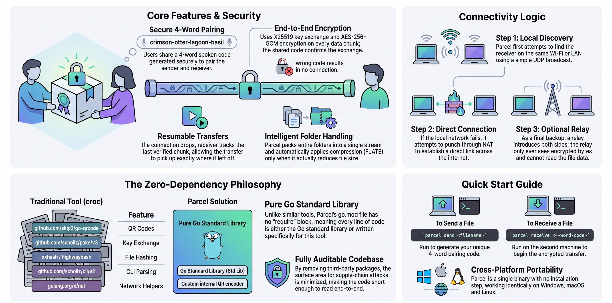
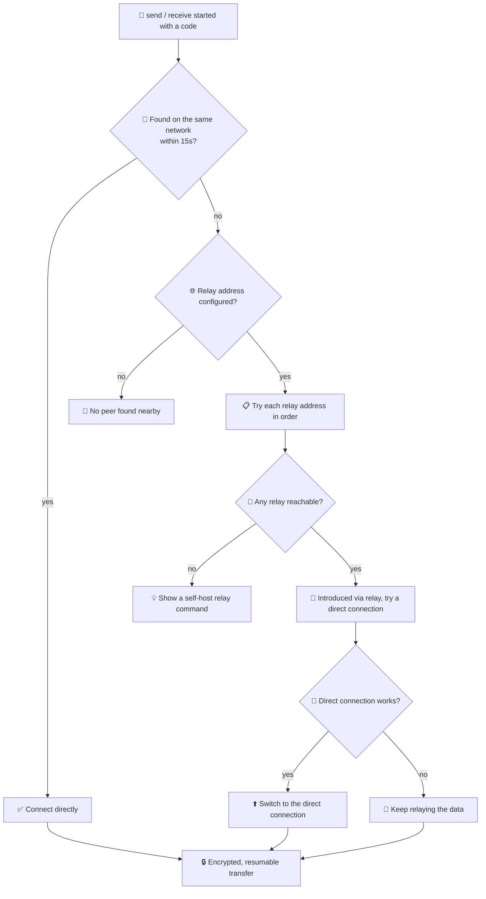
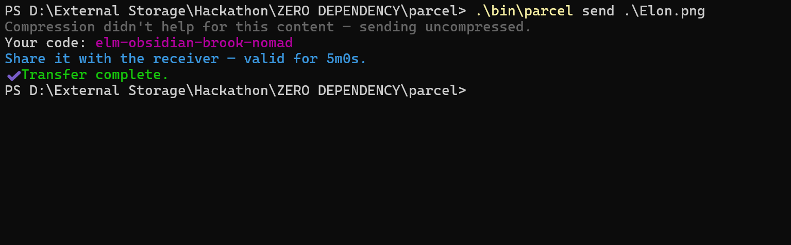
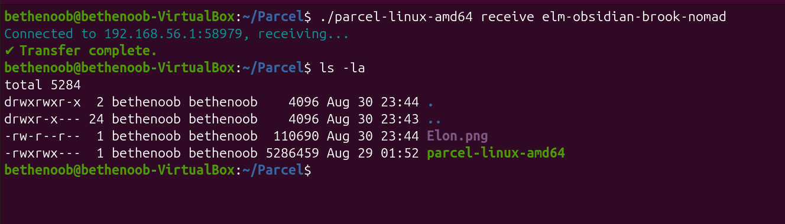
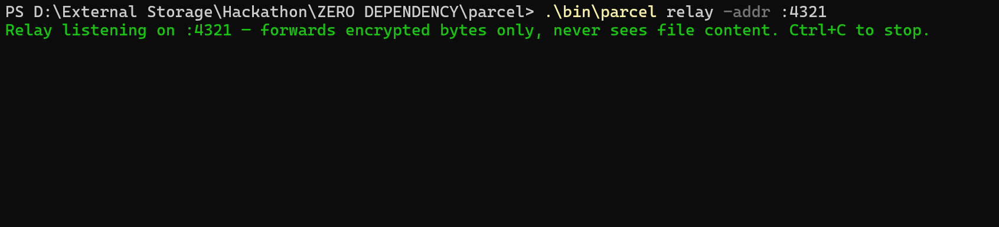
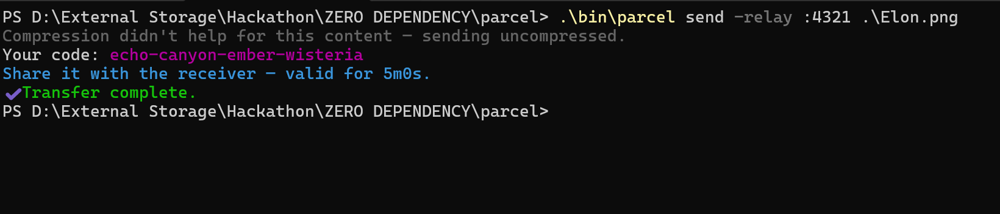
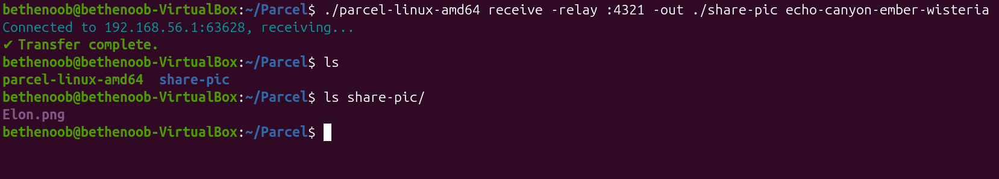

# 📦 Parcel: Secure P2P File Transfer with Zero Dependencies

<div align="center">

[](go.mod) [](deps-proof.txt) [](LICENSE) [](#) [](#) [](#)

</div>

A peer-to-peer, end-to-end encrypted file and folder transfer tool. Two people share a short spoken code, and parcel connects them directly — over the same Wi-Fi, or across the internet through an optional relay. Dropped connections resume automatically instead of starting over. No accounts, no cloud storage, no third-party code — `go.mod` has no `require` block.



Built for the **Zero Dependency** hackathon, **Track C (Web & Network)**.

**Contents:** [🔎 At a glance](#at-a-glance) · [✨ What it does](#what-it-actually-does) · [📸 See it in action](#see-it-in-action) · [⚡ Quick start](#quick-start) · [🌐 Crossing networks](#crossing-networks) · [🧵 Concurrency model](#concurrency-model) · [🚩 Flag reference](#flag-reference) · [🧩 Why zero-dependency](#why-zero-dependency) · [🔍 Verifying it](#verifying-zero-dependencies) · [🔁 Reproducible build](#reproducible-build) · [🗂️ Layout](#layout) · [✅ What's been verified](#whats-been-verified) · [📄 License](#license)

---

## 🔎 At a glance

| | |
|---|---|
| 🔑 **Pairing** | 4-word spoken code, generated securely |
| 🔒 **Encryption** | Strong encryption (the kind behind HTTPS) — wrong code, no connection |
| 🌐 **Connectivity** | Same network first, then a direct connection, then a relay as backup |
| ♻️ **Resumable** | Picks up right where a dropped connection left off |
| 📁 **Folders** | Sends whole folders, compressing them when it helps |
| 📷 **QR pairing** | Optional on-screen QR code as a shortcut for typing |
| 🎨 **Terminal UX** | Colorized output and a live waiting spinner — respects `NO_COLOR`, degrades to plain text when piped |
| 🧩 **Dependencies** | Zero — nothing but Go's standard library |

---

## ✨ What it actually does

| | |
|---|---|
| 🔑 **Pairing** | `parcel send` prints a code like `crimson-otter-lagoon-basil`. Run `parcel receive <code>` on the other machine and it connects on its own. |
| 🔒 **Encryption** | A key exchange (`crypto/ecdh`, X25519) confirmed by the shared code, then AES-256-GCM on every chunk — see `internal/crypto`. Wrong code, no connection. |
| 🔌 **Connection** | Same-network first (`internal/discovery/lan.go`); otherwise a relay introduces both sides, tries a direct link, and relays the data if that's not possible (`internal/discovery/punch.go`). |
| ♻️ **Resumable** | The receiver remembers the last verified chunk in `.part.meta`; the sender picks up right there on reconnect, within the code's 5-minute window. |
| 📁 **Folders** | Packed into one stream (`internal/archive`) and compressed with `compress/flate` (`internal/compress`) when that actually helps. |
| 📷 **QR pairing** | `-qr` on `send` also shows the code as an on-screen QR code (`internal/qr`) — a shortcut, not a replacement for the spoken code. |
| 🎨 **Terminal UX** | Colorized help/status output and an animated spinner while waiting for a peer, both hand-rolled in `internal/ansi` — no `fatih/color`, `mattn/go-isatty`, or `schollz/progressbar`. Auto-disables on `NO_COLOR` or when output isn't a real terminal. |

### 🗺️ How it picks a connection path



---

## 📸 See it in action

| Sender | Receiver |
|---|---|
|  |  |

Same flow on Windows, macOS, or Linux — `parcel` is a single binary with no install step.

---

## ⚡ Quick start

```sh
go build -o bin/parcel ./cmd/parcel
# or: make build
```

On one machine:

```sh
./bin/parcel send ./photo.jpg
# Your code: crimson-otter-lagoon-basil
```

On the other machine (same network, or with a relay configured — see below):

```sh
./bin/parcel receive crimson-otter-lagoon-basil
```

A directory works the same way (`./bin/parcel send ./my-folder`); it arrives unpacked back into a directory on the receiving end.

### 🌐 Crossing networks

**🤔 Why you need a relay:** same-network discovery works by broadcasting to nearby devices — it physically can't reach a machine on a different network (different Wi-Fi, different building, different country). When the two of you aren't on the same network, something reachable from both sides has to introduce you. That's the relay's whole job: a small program that helps two `parcel` clients find each other, and forwards data between them if a direct connection can't be made. It only ever sees already-encrypted bytes — it can't read the file either way.

**1️⃣ Start a relay**, on any machine both sides can reach — a VPS, a spare computer, a cheap cloud instance:

```sh
./bin/parcel relay -addr :4321
```

**2️⃣ Send**, pointing at that relay:

```sh
./bin/parcel send -relay relay.example.com:4321 ./photo.jpg
```

**3️⃣ Receive**, pointing at the same relay:

```sh
./bin/parcel receive -relay relay.example.com:4321 crimson-otter-lagoon-basil
```

(or set `PARCEL_RELAY` once instead of passing `-relay` every time).

`-lan-only` / `-relay-only` force a specific path. `-relay` also takes a comma-separated list (`-relay a.example.com:4321,b.example.com:4321`) — parcel tries each in order and uses the first that answers; give both sides the same list in the same order, since pairing only happens when both land on the same relay. If none answer, parcel prints the exact command to run your own relay.

On a laptop with more than one network connection (Wi-Fi + Ethernet + VPN), pin both sides to the same one with `-iface <name-or-ip>` (or `PARCEL_LAN_IFACE`) so discovery looks in the same place on both ends.

#### 📸 Relay in action

| Relay | Sender | Receiver |
|---|---|---|
|  |  |  |

### 🧵 Concurrency model

The relay handles every pair independently: each accepted connection gets its own goroutine (`go handleRelayConn(...)` in `internal/discovery/relay_server.go`), so one slow or stalled pair never blocks another from pairing. Once two connections are matched, a `splice` step pipes bytes both ways at once — one goroutine copying sender→receiver, another receiver→sender — and closes both sides the moment either one disconnects. On the client side, `send`/`receive` race local-network discovery, the relay, and (once relayed) a direct NAT-punch attempt as concurrent goroutines over channels, using whichever connects first and cleanly discarding the rest — no locks, just goroutines and channel selects, which is what a `sync`/`errgroup`-style dependency would compile down to anyway.

---

## 🚩 Flag reference

Every flag `parcel` understands, what it defaults to, and when you'd actually reach for it. Run `parcel -h` (also `-help` / `--help` / `help`) any time to see this same list from the terminal, colorized when the terminal supports it (auto-disabled when piped, redirected, or `NO_COLOR` is set).

### 🔗 Shared by `send` and `receive`

| Flag | Default | What it does | When to use it |
|---|---|---|---|
| `-lan-only` | off | Only attempts local-network discovery — never contacts a relay, even if `-relay`/`PARCEL_RELAY` is set. | Both machines are definitely on the same network and you want a fast, clear failure instead of waiting on a relay you don't need. |
| `-relay-only` | off | Skips the local-network attempt entirely and goes straight to the relay. Requires `-relay` (or `PARCEL_RELAY`) to be set. | You already know the two machines are on different networks — skips the ~15s local-network wait. |
| `-relay <addrs>` | `PARCEL_RELAY` env var, else empty | Relay server address to fall back to if local-network discovery doesn't find a peer. Accepts a comma-separated list (`a:4321,b:4321`), tried in order until one answers. | Sending or receiving across different networks — different Wi-Fi, different building, different town. Both sides need the **same list in the same order**, since pairing only happens between clients that land on the same relay. |
| `-iface <name-or-ip>` | `PARCEL_LAN_IFACE` env var, else all interfaces | Pins local-network discovery to one network interface. | A laptop or VM host with more than one network connection (Wi-Fi + Ethernet + VPN) where discovery isn't finding the peer because it's listening on the wrong one. |

### 📤 `send`-only

| Flag | Default | What it does | When to use it |
|---|---|---|---|
| `-no-compress` | off | Skips flate compression of the transferred stream. | Rarely needed — parcel already checks whether compression actually shrinks the data and skips it automatically for photos, videos, and zips. Use this to force it off yourself, e.g. to save CPU time on a very large already-compressed folder. |
| `-qr` | off | Also prints the pairing code as a terminal QR code, next to the plain-text code. | The receiver has a phone or camera handy and scanning is quicker than typing a 4-word code. |

### 📥 `receive`-only

| Flag | Default | What it does | When to use it |
|---|---|---|---|
| `-out <dir>` | `.` (current directory) | Directory to write the received file or folder into. | Downloading straight into a specific folder (e.g. `-out ~/Downloads`) instead of wherever the command happens to be run from. |

### 🛰️ `relay`-only

| Flag | Default | What it does | When to use it |
|---|---|---|---|
| `-addr <addr>` | `:4321` | Address (and port) the relay listens on. | Running the relay on a specific port — e.g. because a firewall only opens one — or binding it to one interface (`192.168.1.10:4321`) instead of all of them. |

Two environment variables mirror the most-used flags, so you don't have to repeat them on every command: `PARCEL_RELAY` (same as `-relay`) and `PARCEL_LAN_IFACE` (same as `-iface`).

---

## 🧩 Why zero-dependency

The idea here — code-based pairing, encrypted transfer, resuming after a drop, relaying past NAT — isn't new. `croc` (`github.com/schollz/croc`) already does it, well. What's different is what it's built from: every third-party package a tool imports is code nobody here wrote or reviewed, with its own dependencies riding along. `go.mod` has no `require` block — everything is either Go's standard library or code written in this repo, short enough to actually read end-to-end.

```
Third-party runtime dependencies (direct, per go.mod)

croc     ████████████████████████████████████████████████ 28
parcel   ▏0
```

*(croc `v11`, checked directly against its `go.mod` — 28 direct requires, 77 more transitive on top of that. parcel: `go.mod` has no `require` block at all, direct or transitive. Verify either any time: `curl -s https://raw.githubusercontent.com/schollz/croc/master/go.mod`.)*

### 📊 Head-to-head vs croc — a representative sample, not all 28

| 📦 croc depends on | 🎯 what it's for | 🔧 what parcel uses instead |
|---|---|---|
| `github.com/skip2/go-qrcode` | generates QR codes | its own QR encoder, built from the QR spec — `internal/qr` |
| `github.com/schollz/pake/v3` | code-based key exchange | `crypto/ecdh` (X25519) plus a small hand-written key-derivation step that mixes in the shared code — `internal/crypto/handshake.go` |
| `golang.org/x/crypto` | encryption building blocks | `crypto/aes` + `crypto/cipher`, and `crypto/pbkdf2` (in Go's standard library since 1.24) |
| `github.com/schollz/peerdiscovery` | finds peers on the local network | a small UDP broadcast — `internal/discovery/lan.go` |
| `github.com/kalafut/imohash`, `github.com/cespare/xxhash/v2`, `github.com/minio/highwayhash` | fast file hashing | `crypto/sha256` for verifying each chunk — `internal/transfer` |
| `github.com/schollz/cli/v2` | command-line parsing | Go's own `flag` package |
| `github.com/mattn/go-colorable`, `github.com/mattn/go-isatty` | colored terminal output, including on legacy Windows consoles | hand-rolled `internal/ansi` — raw SGR escape codes plus a per-OS terminal check (`ModeCharDevice` on Unix, `GetConsoleMode`/`SetConsoleMode` via `syscall` on Windows) |
| `github.com/schollz/progressbar/v3` | animated terminal progress indicator | a hand-rolled spinner — `internal/ansi/spinner.go` |
| `github.com/stretchr/testify` | test assertions | Go's own `testing` package |
| `golang.org/x/net`, `golang.org/x/sys`, `golang.org/x/term`, `golang.org/x/time` | extra OS/network helpers | not needed — `net`, `os`, and `time` cover it |

croc also has a few things parcel doesn't try to match: skipping `.gitignore`-matched files when sending a folder, a SOCKS5 proxy option, interactive prompts, and (in its newer `v11` releases) an embedded Tailscale/gVisor network stack (`tailscale.com`, `gvisor.dev/gvisor`) for more advanced connectivity than parcel's plain hole-punch attempt in `internal/discovery/punch.go`. Smaller scope, not a hidden gap.

### 🔐 Self-hosting the relay

croc automatically picks one of three shared public relays for you. Parcel leaves that choice to you — `-relay`/`PARCEL_RELAY` is empty by default. Run `parcel relay -addr :4321` on any machine you already have — 🖥️ a VPS, a spare computer, a cheap cloud instance — and point both sides at it.

🔒 Encryption is what protects the file, no matter whose relay carries it. Choosing your own relay just means it's your machine, your uptime, nobody else's logs in between — and it can be listed first in the fallback list above.

---

## 🔍 Verifying zero dependencies

```sh
go list -m all       # prints only "parcel" — see deps-proof.txt
```

See `STDLIB.md` for exactly what each substitution replaces.

## 🔁 Reproducible build

```sh
make reproducible
```

Builds the artifact twice (`-trimpath -buildvcs=false`, so the result doesn't depend on the build path or git state) and diffs them — verified byte-identical, including from a second, unrelated directory.

### Actual captured run

```
$ go build -trimpath -buildvcs=false -o bin/parcel-a ./cmd/parcel
$ go build -trimpath -buildvcs=false -o bin/parcel-b ./cmd/parcel
$ sha256sum bin/parcel-a bin/parcel-b
03dc436cad930caf9fbfdb8aa93340ac9e5222c63bd9628cb584c752dd4498e2 *bin/parcel-a
03dc436cad930caf9fbfdb8aa93340ac9e5222c63bd9628cb584c752dd4498e2 *bin/parcel-b
$ cmp bin/parcel-a bin/parcel-b && echo byte-identical
byte-identical
```

---

## 🗂️ Layout

```
parcel/
├── cmd/parcel/           CLI entrypoint (send/receive/relay subcommands)
├── internal/
│   ├── codeword/         pairing-code generation (crypto/rand wordlist draw)
│   ├── crypto/           X25519 handshake + AES-GCM chunk stream
│   ├── transfer/         resumable chunked wire protocol, timeouts
│   ├── archive/          hand-rolled folder pack/unpack format
│   ├── compress/         compress/flate wrapper with a skip-if-useless heuristic
│   ├── discovery/        LAN multicast discovery, relay server/client, NAT punching
│   ├── source/           prepares a path (archive? compress?) before sending
│   ├── qr/               from-scratch QR encoder (+ a decoder, used only for tests)
│   └── ansi/             hand-rolled color + spinner (no colorable/isatty/progressbar libs)
├── Makefile              build / test / vet / deps-proof / reproducible
├── STDLIB.md             every stdlib-for-package substitution made
└── deps-proof.txt        go list -m all output
```

Tests live next to the code they cover (`_test.go` files, Go's own idiom) rather than a separate `tests/` tree.

---

## ✅ What's been verified

| Area | Status |
|---|---|
| 🖥️ Local network transfer | ✅ Verified on real hardware (Windows + Linux VM) — byte-identical results (SHA-256 checked) |
| 📁 Folder transfer | ✅ Verified — packed, sent, and unpacked with every file intact across machines |
| 🌍 Cross-network / relay | ✅ Verified across two separate machines, `-relay-only` forced — byte-identical results |
| 📷 QR pairing | ✅ Verified with a real phone camera scan, decoded back to the exact pairing code |
| 🔐 Wrong-code handling | ✅ Verified — a mismatched code never pairs; fails closed instead of connecting a stranger |
| 🔌 Direct internet connection | ✅ Works on most home routers; falls back to relaying the data automatically elsewhere |
| 🔑 Pairing codes | ✅ 4 words, chosen to keep coincidental matches astronomically rare |
| 🗜️ Compression | ✅ Skipped automatically when it wouldn't help (photos, videos, zips) |

A couple of good-to-knows: on a machine with more than one network connection, use `-iface`/`PARCEL_LAN_IFACE` (see [Crossing networks](#crossing-networks)) so both sides look in the same place; and the relay only ever forwards already-encrypted bytes, whether it's yours or someone else's.

---

## 📄 License

⚖️ MIT — see `LICENSE`. 🎉
